<a href="https://trendshift.io/repositories/9828" target="_blank"></a>

# GLaDOS Personality Core

This is GLaDOS from Portal, running on real hardware. She sees, hears, speaks, and judges you accordingly.

Not a chatbot. She doesn't wait for you to talk to her—she observes, decides when to comment, and maintains opinions about your life choices.

[Join our Discord!](https://discord.com/invite/ERTDKwpjNB) | [Sponsor the project](https://ko-fi.com/dnhkng)

https://github.com/user-attachments/assets/c22049e4-7fba-4e84-8667-2c6657a656a0

## What's New

- **Vision**: FastVLM gives her eyes. [Details](/vision.md) | [Demo](https://www.youtube.com/watch?v=JDd9Rc4toEo)
- **Autonomy**: She watches, waits, and speaks when she has something to say. [Details](/autonomy.md)
- **MCP Tools**: Extensible tool system for home automation, system info, etc. [Details](/mcp.md)
- **8GB SBC**: Runs on a Rock5b with RK3588 NPU. [Branch](https://github.com/dnhkng/RKLLM-Gradio)

## Roadmap

- [x] Train GLaDOS voice
- [x] Personality that actually sounds like her
- [x] Vision via VLM
- [ ] Long-term memory
- [ ] 3D-printable enclosure
- [ ] Animatronics

## Architecture

```mermaid
flowchart TB
    subgraph Input
        mic[🎤 Microphone]
        tick[⏱️ Timer]
        cam[📷 Camera]
    end

    subgraph Core["Main Agent"]
        vad[VAD]
        asr[ASR]
        llm[🧠 LLM]
        tts[TTS]
    end

    ctx[📋 Context]

    subgraph Minds["Subagents"]
        weather[Weather]
        emotion[Emotion]
        news[News]
        memory[Memory]
    end

    subgraph Output
        speaker[🔊 Speaker]
        images[🖼️ Images]
        motors[⚙️ Animatronics]
    end

    mic --> vad --> asr -->|priority| llm
    tick --> Minds
    cam --> Minds
    tick -->|autonomy| llm
    llm --> tts --> speaker

    Minds -->|write| ctx
    ctx -->|read| llm
    llm <-->|MCP| tools[Tools]
    tools --> images
    tools --> motors
```



GLaDOS runs a loop: each tick she reads her slots (weather, news, vision, mood), decides if she has something to say, and speaks. No wake word—if she has an opinion, you'll hear it.

**Two lanes**: Your speech jumps the queue (priority lane). The autonomy lane is just the loop running in the background. User always wins.

### Context Structure

What the LLM actually sees:


### Subagents

Independent processes that feed context to the main agent via slots:

```mermaid
flowchart LR
    subgraph Triggers
        tick[⏱️ Timer]
        cam[📷 Camera]
    end

    subgraph Subagent["Subagent (e.g. Weather)"]
        loop[Run Loop]
        decide[LLM Decision]
        slot[Write Slot]
    end

    subgraph Main["Main Agent"]
        read[Read Slots]
        respond[Generate Response]
    end

    tick -->|OR| loop
    cam -->|OR| loop
    loop --> decide --> slot
    slot -.->|async| read
    read --> respond
```



Each subagent runs its own loop: timer or camera triggers it, it makes an LLM decision, and writes to a slot the main agent reads. Fully async—subagents never block the main conversation.

### Components

| What | Status | Notes |
|------|--------|-------|
| Speech recognition | ✅ | NVIDIA Parakeet TDT |
| Voice synthesis | ✅ | Kokoro (streaming) |
| Vision | ✅ | FastVLM via ONNX |
| Autonomy | ✅ | Timer or vision triggers |
| MCP Tools | ✅ | System, Home Assistant, etc |
| Interrupt handling | ✅ | Talk over her, she stops |
| Emotional state | 🔨 | Mood affects responses |
| Long-term memory | 🔨 | Facts + conversation summaries |
| Observer agent | 🔨 | Meta-supervision layer |

✅ = Done | 🔨 = In progress

## Quick Start

1. Install [Ollama](https://github.com/ollama/ollama) and grab a model:
   ```bash
   ollama pull llama3.2
   ```

2. Clone and install:
   ```bash
   git clone https://github.com/dnhkng/GLaDOS.git
   cd GLaDOS
   python scripts/install.py
   ```

3. Run:
   ```bash
   uv run glados          # Voice mode
   uv run glados tui      # Text interface
   ```

## Installation

### GPU Setup (recommended)

- **NVIDIA**: Install [CUDA Toolkit](https://developer.nvidia.com/cuda-toolkit)
- **AMD/Intel**: Install appropriate [ONNX Runtime](https://onnxruntime.ai/docs/install/)

Works without GPU, just slower.

### LLM Backend

GLaDOS needs an LLM. Options:
1. [Ollama](https://github.com/ollama/ollama) (easiest): `ollama pull llama3.2`
2. Any OpenAI-compatible API

Configure in `glados_config.yaml`:
```yaml
completion_url: "http://localhost:11434/v1/chat/completions"
model: "llama3.2"
api_key: ""  # if needed
```

### Platform Notes

**Linux:**
```bash
sudo apt install libportaudio2
```

**Windows:**
Install Python 3.12 from Microsoft Store.

**macOS:**
Experimental. Check Discord for help.

### Install

```bash
git clone https://github.com/dnhkng/GLaDOS.git
cd GLaDOS
python scripts/install.py
```

## Usage

```bash
uv run glados                           # Voice mode
uv run glados tui                       # Text UI
uv run glados start --input-mode text   # Text only
uv run glados start --input-mode both   # Voice + text
uv run glados say "The cake is a lie"   # Just TTS
```

### TUI Commands

Type `/help` in the TUI. Highlights:

| Command | What it does |
|---------|-------------|
| `/status` | System overview |
| `/asr on\|off` | Toggle speech recognition |
| `/slots` | View subagent outputs |
| `/minds` | Active subagents |
| `/vision` | Camera status |
| `/knowledge add\|list` | User facts |

## Configuration

### Change the LLM

```bash
ollama pull mistral
```

Then in `glados_config.yaml`:
```yaml
model: "mistral"
```

Browse models: [ollama.com/library](https://ollama.com/library)

### Change the Voice

Kokoro voices in `glados_config.yaml`:
```yaml
voice: "af_bella"
```

**Female US:** af_alloy, af_aoede, af_jessica, af_kore, af_nicole, af_nova, af_river, af_sarah, af_sky
**Female UK:** bf_alice, bf_emma, bf_isabella, bf_lily
**Male US:** am_adam, am_echo, am_eric, am_fenrir, am_liam, am_michael, am_onyx, am_puck
**Male UK:** bm_daniel, bm_fable, bm_george, bm_lewis

### Custom Personality

Copy `configs/glados_config.yaml`, edit the personality:

```yaml
personality_preprompt:
  - system: "You are a sarcastic AI who judges humans."
  - user: "What do you think of my code?"
  - assistant: "I've seen better output from a random number generator."
```

Run with:
```bash
uv run glados start --config configs/your_config.yaml
```

### MCP Servers

Add tools in `glados_config.yaml`:

```yaml
mcp_servers:
  - name: "system_info"
    transport: "stdio"
    command: "python"
    args: ["-m", "glados.mcp.system_info_server"]
```

Built-in: `system_info`, `time_info`, `disk_info`, `network_info`, `process_info`, `power_info`, `memory`

See [mcp.md](/mcp.md) for Home Assistant integration.

## TTS API Server

Expose Kokoro as an OpenAI-compatible TTS endpoint:

```bash
python scripts/install.py --api
./scripts/serve
```

Or Docker:
```bash
docker compose up -d --build
```

Generate speech:
```bash
curl -X POST http://localhost:5050/v1/audio/speech \
  -H "Content-Type: application/json" \
  -d '{"input": "Hello.", "voice": "glados"}' \
  --output speech.mp3
```

## Troubleshooting

**She keeps responding to herself:**
Use headphones or a mic with echo cancellation. Or set `interruptible: false`.

**Windows DLL error:**
Install [Visual C++ Redistributable](https://learn.microsoft.com/en-us/cpp/windows/latest-supported-vc-redist).

## Development

Explore the models:
```bash
jupyter notebook demo.ipynb
```

## Star History

[](https://star-history.com/#dnhkng/GlaDOS&Date)

## Sponsors

<div align="center">

### [Wispr Flow](https://ref.wisprflow.ai/qbHPGg8)

[](https://ref.wisprflow.ai/qbHPGg8)

[**Talk to code, stay in the Flow.**](https://ref.wisprflow.ai/qbHPGg8)

</div>
